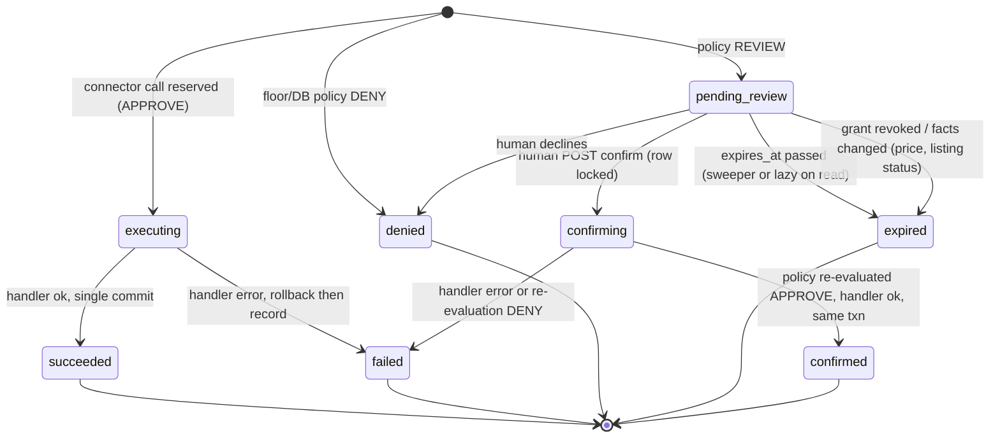

# Connector action path: every connector write through ActionRegistry + PolicyEngine, pending actions, one checkout domain service

Status: DRAFT for Gate 1 round 2. Round-1 Council reviews (GLM REQUEST_CHANGES, DeepSeek APPROVE, Gemini APPROVE_WITH_MANDATES; `council/{glm,deepseek,gemini}/response-20260923-1250*.md`) folded 2026-09-23 per controller rulings R1–R7: `confirm_receipt` REVIEW always, downgrade keeps history, NULL-safe one-open-handoff index, `dispatch_order_payout` in the runtime guard, audit `event_type`, §4.7 references, shared OAuth/core rulings. Tier: **CORE S3 Tier 3** (auth, payments, customer data, fail-closed envelope): GLM + DeepSeek + Gemini, unanimous; MP builds and does not vote; 3-round cap (`runbooks/council-gate-process.md` §Tier rules, E-01).
Build Queue entity: `build:bq-connector-action-path` (P0).
Design authority: `specs/BQ-CUSTOMER-MCP-CONNECTOR-DESIGN.md` v3 (2026-09-23, approved by Max for build), §3 "Action path", §4 tools table and REVIEW list, §6 audit, §8 row `bq-connector-action-path`. Max decisions D1 (link-out checkout, no money in the connector), D4 (autonomy only inside owner limits), D7 (attribution by OAuth client) are binding here and are not reopened.
Backend ground truth: `ai-market-backend` **`origin/main` `75c8be503`** (2026-09-23). The design pinned an older commit; the Titan-1 checkout is still detached there, 22 commits behind, including all of S1735 chunk E. Every `file:line` below is against `75c8be503` (read with `git show origin/main:<path>`, nothing checked out or written). Anything not read directly is marked **UNVERIFIED**.
Licence authority: `specs/BQ-LISTING-LICENSES-S1735-GATE1.md` (approved) and `-GATE2.md` (approved 3/3 r3 `51581db9`); their constructor, refusal matrix and issuance helper are consumed here unchanged.

## 0. Plain-English summary (for Max)

When someone's Claude or ChatGPT does something on ai.market for them, it must go through the same rulebook the rest of the platform uses, and anything that commits them to something (paying, publishing, releasing money) must be finished by the human in a browser, not by the chatbot. This BQ builds three things:

1. **One rulebook.** Every connector action (send an inquiry, publish a listing, confirm receipt…) is registered as an "action" and runs through the existing policy engine, which answers *go*, *ask the human*, or *no*.
2. **"Ask the human" that actually requires a human.** If the answer is "ask the human", we save the exact request and give back a one-time link. The user opens it on ai.market, logs in, sees exactly what the assistant wants to do, and clicks Confirm or Decline. The chatbot can retry as often as it likes; the action happens once.
3. **One checkout.** Today the website and the old MCP tools each build orders and Stripe sessions their own way. We make one checkout service. The connector can only produce a *checkout link* — no order, no charge. The order is created on the website after the buyer accepts the licence and pays, exactly as for a web buyer.

It also answers "who did what, through which app, and who approved it" for every call.

## 1. Problem

The design requires (§3) that every connector write be an action executed through `ActionExecutorService → PolicyEngine`, that REVIEW produce a `pending_action` the LLM cannot complete, and that checkout be one domain service shared by web and connector. The code today has none of these properties for the connector's tool set:

- The action registry has no buyer actions and most connector tools have no registered action (§2.1).
- The executor's REVIEW gate is a caller-supplied boolean (§2.2).
- There are three live, divergent purchase paths, two of which create orders and Stripe sessions from an API credential (§2.4).
- Idempotency exists only for MCP API keys and fails open (§2.5).
- The audit table has no user, org, OAuth client, policy decision or pending-action columns (§2.6).
- Confirming receipt on an order with no transaction row pays the seller synchronously (§2.7) — a connector `confirm_receipt` built naively would move money.

## 2. Current state, with evidence (`origin/main` `75c8be503`)

### 2.1 Action registry
- `ActionRegistry` is a process singleton loading four static lists (`app/actions/registry.py:41-64`). `ActionDefinition` (`registry.py:24-39`) has `permissions_required`, `tier_required`, `destructive`, `reversible`, `requires_reauth`, `rate_limit`, `trust_channel_required`; no scopes, no JSON schema, no idempotency, no open-world flag.
- `AIMARKET_ACTIONS` (`app/actions/definitions.py:315` onward) covers listing list/get/create/ingest/update/publish/unpublish/archive/delete (`:318-427`), inquiry list/get/respond/close/auto_respond (`:431-489`), profile, billing, Stripe, analytics, email, admin accounting. **No** order, checkout, data-request, rating, delivery-confirmation, offer or sample action exists.
- Registry/dispatch drift (surprises):
  - `aim.inquiry.create` has a dispatch branch (`app/services/action_executor_service.py:531-540`) but is not registered, so `registry.get` returns `Unknown action` (`:103-105`) — dead code.
  - `aim.listing.publish`/`unpublish`/`get`/`delete` are registered (`definitions.py:379-427`) but `_dispatch` has no branch for them (`action_executor_service.py:474-518`); they fall to `raise ValueError("No handler wired…")` (`:619`).
  - `aim.listing.update` is registered with parameter `listing_id` (`definitions.py:372`) but dispatched on `parameters.get("id")` (`action_executor_service.py:504`); `aim.inquiry.respond` declares `message` (`definitions.py:459`) but dispatches on `content` (`action_executor_service.py:544`).

### 2.2 Executor and REVIEW
- `ActionExecutorService.execute` (`action_executor_service.py:71-279`): permission → reauth → `PolicyEngineService.evaluate` → DENY returns error (`:148-152`); REVIEW returns `needs_confirmation` **unless `pre_authorized=True`** (`:154-164`); APPROVE auto-executes only for `is_agent` principals (`:166-171`); human principals then fall to user CONFIRM preferences (`:174-186`).
- `pre_authorized` is a request field (`app/schemas/action.py:40`) passed straight through by `POST /actions/execute` (`app/api/v1/endpoints/actions.py:113-121`) for any `get_current_active_user`. **Any bearer that authenticates there can self-approve REVIEW.** The legacy MCP JSON-RPC surface hard-codes `pre_authorized=False` (`app/api/v1/endpoints/mcp.py:232-240`), so its REVIEW is simply a dead end. Whether an OAuth access token (`type: oauth_access`, `app/services/oauth_service.py:354,375`) is accepted by `get_current_active_user` is **UNVERIFIED**; this BQ makes it impossible by construction (§5 I3).
- Policy inputs: `resource=parameters.get("id","*")` (`:143`) and `_estimated_cost` from **caller-supplied** `amount`/`price` (`:858-877`). JSON-Logic conditions evaluate against caller parameters (`policy_engine_service.py:238-251`), e.g. the global rule DENY `aim.listing.create` when `privacy_score < 5` (`:461-464`) reads a value the caller sends.
- Audit write `_log_action` inserts into `allai_action_log` and **commits the session** (`:781-825`), including on the exception path (`:257-279`): partial writes flushed by a failed dispatch can be committed. Redaction is a key denylist (`:834-838`); free text is logged verbatim.

### 2.3 PolicyEngine
- Models `Policy`/`PolicyRule`/`PolicyEvaluationLog` (`app/models/policy.py:76-198`); scopes global/organization/user/agent (`:31-36`); decisions approve/review/deny (`:39-43`); rule default effect REVIEW (`:136`).
- Evaluation: DB policies in scope, **ordered by `Policy.priority` desc, first matching rule wins** (`policy_engine_service.py:182-199, 206-215`); then built-in lists `SAFE_ACTIONS`/`REVIEW_ACTIONS`/`DENY_ACTIONS` (`:56-86`); fallback REVIEW (`:288-291`). The seeded global policy has priority 0 "easily overridden" (`:452`); the per-user default has priority 10 (`:378`). **Any org/user/agent policy with priority > 0 overrides the global DENY rules** — there is no platform floor. No user-facing policy write API was found (only seeding from `app/core/bootstrap.py:93-114`) — **UNVERIFIED** that none exists in admin routes.
- `_log_evaluation` does not commit (`:322`). A second, unrelated engine exists for finance agents (`app/services/finance/policy_engine.py`, AUTO/PROPOSE/BLOCKED with `FinanceAgentProposal`, `app/models/finance.py:143-172`, which carries `idempotency_key UNIQUE`, `approval_expires_at`, `policy_snapshot_json`) — useful precedent, not reused.

### 2.4 Three purchase paths (the divergence)
| Aspect | Web `POST /checkout/create` (canonical tx, `ENABLE_CANONICAL_TX` default `True`, `app/core/config.py:152`) | MCP tool `tool_initiate_purchase` (`app/services/mcp_marketplace_tools.py:695-936`) | MCP REST `POST /mcp/orders/initiate` (`app/api/v1/endpoints/mcp_marketplace.py:603-760`) |
|---|---|---|---|
| Entry | `checkout.py:138-191` → `TransactionService.initiate` (`transaction_service.py:251`) + `create_checkout` (`:1295-1692`) | direct SQL + `OrderService.create_order` (`:830-838`) | `create_order` at `mcp_marketplace.py:703` |
| Transaction row | yes; auto-quote/accept (`:1366-1380`), order linked (`:1423-1426`) | **none** (order `transaction_id` NULL) | **none** (UNVERIFIED beyond `:703`) |
| Platform-terms gate | `initiate` (`:273-275`) + constructor (`order_service.py:673-685`) | constructor only | constructor only |
| Licence acceptance | `channel="web"`, typed name, IP/UA via tx metadata (`checkout.py:158-171`, `transaction_service.py:1391-1403`) | `channel="mcp"`, hashes only, `principal_ref=user:`, `credential_id=api_key_id` (`:817-829`) | UNVERIFIED |
| Existing-order guard | **none** on canonical path (legacy branch only, `checkout.py:227-238`) | yes, excluding `completed` (`:789-800`) | UNVERIFIED |
| Free listing / workspace / reference delivery | handled (`transaction_service.py:1477-1561`) | **not handled** — a $0 listing goes to Stripe | UNVERIFIED |
| Delivery-readiness preflight | workspace only, inside constructor (`order_service.py:281-285` → `seller_workspace_delivery.py:156-179`) | same (constructor) | same |
| Stripe session | metadata `order_id`, `transaction_id` (`:1651-1669`); no `expires_at`, no Stripe idempotency key | metadata `mcp_initiated`, no `transaction_id` (`:847-870`); no Stripe idempotency key | UNVERIFIED |
| Idempotency | none | `mcp_idempotency_keys`, request hash over `listing_id` only (`:729-745`), stored after commit (`:893-901`) | optional header (`:609-628`) |
| Settlement | `TransactionService.settle()` after hold | **synchronous payout on confirm** (§2.7) | same as MCP tool |

A fourth order creator is the agent-key flow (`transaction_service.py:910-980`, `create_agent_checkout` `:1005`) with spend caps on `agent_api_keys` (`:246`), and a fifth is the wallet path (`agent_service.py:548,577`). S1735 already made `OrderService.create_order` (`order_service.py:651-706`) the only constructor and the licence gate its precondition; this BQ does not touch the constructor.

### 2.5 Idempotency
`mcp_idempotency_keys` unique on `(api_key_id, endpoint, key)` (`alembic/versions/20260222_002_idempotency_key_scoping.py`); helpers `check_idempotency`/`store_idempotency` (`app/services/mcp_middleware_service.py:208-279`): 24 h TTL, keyed on an **API key id** (OAuth grants have none), check-then-act with no in-flight reservation, store in a separate commit after the effect, and **both helpers swallow errors and proceed** (`:251-253`, `:277-279`). Not reusable for the connector's exactly-once requirement.

### 2.6 Audit
`AgentAuditLog` (`app/models/agent_audit_log.py:16-34`): `api_key_id`, `tool_name`, `listing_id`, `transaction_id`, `client_ip`, `request_payload`/`response_payload` JSONB, `http_status`, `status`, `error_message`, `duration_ms`. Append-only trigger `trg_agent_audit_log_append_only` (`alembic/versions/20260823_002_repair_agent_audit_log_schema.py:174-179`). No user, org, OAuth client, grant, action, policy decision, pending-action or args-hash column.

### 2.7 Delivery, receipt, rating (money-adjacent)
- `POST /orders/{id}/confirm` (`orders.py:781-818`) → `OrderService.confirm_order` (`order_service.py:1816-1904`): if the order has a `transaction_id`, settlement is deferred to `TransactionService.settle()` (`:1877-1887`); **otherwise it calls `dispatch_order_payout` immediately** (`:1902-1904`). Orders from both MCP purchase paths have no transaction (§2.4), so confirming them transfers seller funds in-request.
- A second confirm exists on deliveries: `POST /deliveries/{tx}/confirm` (`deliveries.py:155-181`, auth `get_user_or_internal_key`).
- `POST /orders/{id}/deliver` (`orders.py:859-898`) takes a seller storage `file_path` → `initiate_delivery` (`order_service.py:1299`).
- Download doors: `orders.py:346-610` (download, redeem, refresh, download-token, access) and `deliveries.py:92-153`; S1735's `require_active_license_acceptance` (`app/services/license_access_service.py:90`) and `active_license_gate` (`:59`) guard them; Seller Workspace issuance `seller_workspace_delivery.py:302-339`.
- Ratings: `POST /ratings` (`app/api/v1/endpoints/ratings.py:47-66`, one per completed order). Inquiries: `POST /inquiries/`, `/{id}/respond`, `/{id}/close` (`inquiries.py:143,506,689`). Data requests: `POST /requests`, `/{id}/responses` (`requests.py:109,413`). Listings publish/unpublish (`listings.py:625,610`).
- Quotes: there is **no Quote model**; `request_responses.proposed_price` (`app/models/data_request.py:278`) is the only priced counter-object and has no purchase path (UNVERIFIED that none exists elsewhere).

## 3. Scope and non-goals

**In scope.** (1) Connector action definitions for all 29 design tools in `ActionRegistry`, executed by a connector entrypoint on `ActionExecutorService` with a non-overridable platform policy floor. (2) `connector_action_requests` (idempotency + outcome for every connector write) and `pending_actions` (REVIEW) with the state machine in §4.3, the web confirmation page and its API. (3) `CheckoutDomainService` shared by web and connector; `checkout_handoffs`; delivery-readiness preflight; web checkout refactored onto it without behaviour change. (4) The tool map (§4.7), generated JSON schemas, negative-test plan. (5) Idempotency on every write. (6) Audit decision fields (`policy_decision`, `pending_action_id`, `binding_terms`) written to core's `connector_audit_events`, and redaction rules; `agent_audit_log` is not changed.

**Non-goals.** OAuth issuer, grants, profiles, tools/list filtering, Redis limits, kill-switch plumbing, the MCP server process (`bq-connector-oauth`, `bq-connector-core`); implementing P1–P3 tool handlers beyond the action definitions, schemas and the checkout/confirm/pending services (handlers land in `bq-connector-buyer`/`-seller`/`-negotiation`, each binding to its row in §4.7); offers backend and negotiation limits (`bq-negotiation-offers`); retiring `tool_initiate_purchase`, `/mcp/orders/initiate`, legacy MCP JSON-RPC (`bq-mcp-surface-retirement`); download-door unification (S1711); any change to `OrderService.create_order`, licence hashing or the S1735 refusal matrix; money movement of any kind.

## 4. Design

### 4.1 Action definitions
Extend `ActionDefinition` (`registry.py:24-39`) with optional fields (defaults preserve every existing action):
`effect: Literal["read","reversible","non_destructive","destructive"]`, `open_world: bool`, `scopes_required: tuple[str,...]` (connector OAuth scopes, design §3), `input_model`/`output_model` (Pydantic v2 classes), `idempotent_write: bool`, `connector_exposed: bool`, `binding: bool` (terms-bearing; drives audit evidence), `review_expiry: timedelta`.
New list `CONNECTOR_ACTIONS` in `app/actions/connector_definitions.py`, loaded by `_register_all_actions` (`registry.py:57-64`). Names are `aim.<resource>.<verb>` (§4.7). Registration fails at import if a name collides, a write lacks `input_model`, or a `connector_exposed` write lacks `idempotent_write=True` (static test).
The four drift bugs in §2.1 are fixed in this BQ only where a connector action reuses the branch (`aim.listing.update`, `aim.inquiry.respond`, publish/unpublish); the dead `aim.inquiry.create` branch is replaced by the registered connector action.

### 4.2 Execution path
New method `ActionExecutorService.execute_connector(principal: ConnectorPrincipal, action_name, args, idempotency_key) -> ConnectorOutcome`. `ConnectorPrincipal` is built by `bq-connector-core` from the verified token: `user_id`, `org_id` (`None` for a personal grant), `org_role` (`None` when `org_id` is `None`), `oauth_client_id`, `grant_id`, `profile` (from the grant, never from the route), `scopes`, `token_jti` (populated by core from `VerifiedToken.token_jti`, the access token's `jti` claim). The legacy `execute()` is unchanged except for the `_log_action(commit=...)` parameter below.

Order of operations, all in **one DB transaction** except where stated:
1. Registry lookup; unknown or `connector_exposed=False` → `TOOL_NOT_FOUND`. Flag/kill-switch check (core).
2. Validate `args` against `input_model` (`extra="forbid"`, length caps). Normalise, then `args_hash = sha256(canonical_json(args))` using S1735's canonical JSON (`app/services/license_hashing.py`, M7) with domain tag `aim.connector.args.v1`.
3. Scope check, all-of semantics (`scopes_required ⊆ principal.scopes`: every required scope must be granted; the same rule core applies to `tools/list` visibility and `tools/call`) and live role check (core's org binding — active membership in `org_id`, or no active membership for a personal grant — plus `assert_user_capability` for seller actions, as `action_executor_service.py:475-476` already does). Ownership of every referenced id is resolved server-side and filtered by user and, when `org_id` is set, by org (cross-org → `NOT_FOUND`, never `FORBIDDEN`, to avoid oracle).
4. **Idempotency reservation**: `INSERT INTO connector_action_requests (...) ON CONFLICT (user_id, oauth_client_id, action_name, idempotency_key) DO NOTHING RETURNING id`. If no row returned, `SELECT … FOR UPDATE` the existing row (a concurrent in-flight insert blocks here until its transaction ends): same `args_hash` → return its recorded outcome (final status, or `pending_review` with the same confirmation URL); different hash → `IDEMPOTENCY_CONFLICT` (409). Nothing else runs.
5. **Server-derived policy facts**: the executor builds `facts` (price from the listing/quote row, buyer threshold, order dispute state, listing review flags, org, client, profile) and passes `facts` — never raw args — as JSON-Logic input. `resource` is the resolved primary id.
6. **Platform floor** (new, code-defined, evaluated before DB policies, cannot be overridden by any DB policy): the REVIEW cases of design §4 (checkout handoff above buyer threshold; publish flagged by review rules; delivery on a disputed order; offer acceptance outside limits) plus `confirm_receipt` always (Council mandate, adopted defaults), and DENY cases (the `D` entries in the §4.7 Policy column; any connector action that would reach a Stripe create/transfer/payout call, `dispatch_order_payout`, a wallet mutation or `OrderService.create_order`). Then `PolicyEngineService.evaluate(..., agent_id=grant_id)` for DB policies, which may only *tighten* (APPROVE from the DB never lifts a floor REVIEW/DENY). Connector principals ignore user CONFIRM preferences except to tighten APPROVE → REVIEW.
7. DENY → request row `denied`, audit, actionable error (`POLICY_DENIED`, reason, web link where the human can do it). REVIEW → `pending_actions` row (§4.3), request row `pending_review`, audit, return `{status:"needs_human", confirmation_url, expires_at, pending_action_id}`. APPROVE → dispatch the handler with the session (handlers never commit), request row `succeeded` with a redacted `result_json`, audit row; then **one commit**. External effects (email, notifications) are written to an outbox in the same transaction and sent post-commit, keyed by request id.
8. Handler exception → rollback of the whole unit; a fresh short transaction records request `failed` (terminal, retry with the same key returns the failure; a new key is needed to try again) and the audit row. `_log_action` gains `commit: bool = True`; the connector path passes `False` so no partial effect can be committed (fixes §2.2 for this path; legacy callers unchanged).

### 4.3 `pending_action` state machine

`confirming` is a lock-held transient inside one transaction, not a persisted status. Design statuses `pending_review|confirmed|denied|expired` are kept; `failed` is added (terminal) because confirmation can fail on re-evaluation — flagged for Gate review.

### 4.4 Data model and migration (`alembic/versions/2026XXXX_001_connector_action_path.py`, additive, reversible)
- `connector_action_requests`: `id` uuid pk; `user_id`, `org_id` (nullable: personal grant), `oauth_client_id`, `grant_id`, `token_jti`, `trace_request_id` (core's `request_id`, the join key to `connector_audit_events`); `action_name`, `action_version`; `idempotency_key` varchar(255); `args_hash` char(64); `args_json` JSONB (validated, stored for REVIEW re-execution; free-text fields kept here only while `pending_review`, nulled on terminal — §4.8); `status` enum `executing|succeeded|failed|pending_review|confirmed|denied|expired`; `policy_decision`, `policy_source` (`floor|db|builtin`), `policy_rule_id`; `result_json` (redacted), `error_code`; `created_at`, `finished_at`. `UNIQUE (user_id, oauth_client_id, action_name, idempotency_key)`; indexes `(org_id, created_at)`, `(user_id, created_at)`. Retention of rows: 90 days after terminal, then `args_json`/`result_json` nulled (audit rows are the durable record). Idempotency window therefore ≥ 90 days (vs 24 h today).
- `pending_actions`: `id` uuid pk; `request_id` FK unique; `user_id`, `org_id` nullable (the only person who may confirm: the same user, still a live member of the same org with the action's role, or, when `org_id` is NULL, still without an active membership); `confirm_token_hash` char(64) (sha256 of a 256-bit random token; token never stored); `summary_json` (server-rendered, human-readable terms shown on the page); `facts_hash` (hash of the facts in step 5, re-checked at confirm); `status` `pending_review|confirmed|denied|expired|failed`; `expires_at` (per action, default 24 h, handoff 1 h); `decided_at`, `decided_by_user_id`, `decision_session_hash`, `decision_ip`, `decision_user_agent`, `decision_auth_time`; `consumed_at`. Check constraint: terminal ⇒ `decided_at` or `expired`. Status moves only by `UPDATE … WHERE status='pending_review'` (compare-and-set).
- `checkout_handoffs`: `id`; `token_hash`; `buyer_user_id`, `buyer_org_id` (nullable); `listing_id`, `listing_version_id`, nullable `quote_id` (FK added by `bq-negotiation-offers`; column nullable now); `price_cents_snapshot`, `currency`; `license_sha256_snapshot`, `covenant_sha256_snapshot`, `rider_sha256_snapshot` (display/staleness only — acceptance still happens at the constructor); `oauth_client_id`, `request_id` (attribution D7); `status` `open|consumed|expired|superseded`; `consumed_order_id`; `expires_at` (24 h); `created_at`. Partial unique expression index, NULL-safe because `quote_id` is NULL until P3 (an ordinary composite unique index treats NULLs as distinct): `CREATE UNIQUE INDEX uq_checkout_handoffs_one_open ON checkout_handoffs (buyer_user_id, listing_id, COALESCE(quote_id, '00000000-0000-0000-0000-000000000000'::uuid)) WHERE status = 'open'`. `create_handoff` supersedes the existing open row (`UPDATE … SET status='superseded' WHERE … AND status='open'`) and inserts the new one in the same transaction; a concurrent insert that loses on the index retries once by re-reading the winner and superseding it, so at most one handoff per buyer/listing/quote is ever `open`.
- No audit table or column is added here: audit rows go to core's `connector_audit_events` (core §5.9; its migration creates the `policy_decision`, `pending_action_id`, `binding_terms` columns this BQ fills). `agent_audit_log` is not changed. `policy_source`, `policy_rule_id` and the idempotency key stay on `connector_action_requests` (joined by `trace_request_id`); `actor_kind` (`llm_client|human_web|server_auto`) and approval evidence go into `binding_terms`.
Downgrade retains history: it never drops `connector_action_requests`, `pending_actions` or `checkout_handoffs` while any row exists in any of them (the migration's `downgrade()` checks and raises, refusing, if any row exists; only on an empty database does it drop them). These tables are the idempotency store for a ≥ 90-day window; losing them would let an old retry run again after re-enable. Operational rollback never uses downgrade (§8).

### 4.5 APIs and pages
Connector side (MCP tools, shipped by core/buyer/seller BQs) only ever calls `execute_connector`. New backend routes, **first-party web session only** (cookie session + CSRF; OAuth MCP-audience tokens and API keys rejected by a dependency that checks token type/audience):
- `GET /api/v1/pending-actions/{id}?t=<token>` → summary, status, requesting app (client display name from the verified registration, not client-supplied), requested time, expiry, and the exact effect in plain language. Token and session user must both match; otherwise uniform 404.
- `POST /api/v1/pending-actions/{id}/confirm` body `{token, csrf, summary_hash}` → locks the pending row `FOR UPDATE` and its request row; requires status `pending_review`, not expired, `decision_auth_time` within 15 min (else 401 `REAUTH_REQUIRED` → login round trip; for `binding` actions 2FA users must re-verify); recomputes facts, compares `facts_hash` (mismatch → `expired` with reason `CHANGED`, user told to ask again) and `summary_hash` (the page must be the one the user saw); re-evaluates floor + DB policy with `actor_kind=human_web` (DENY → `failed`); executes the handler in the same transaction; writes `confirmed` + audit + outbox; commits once. Response is the final outcome.
- `POST /api/v1/pending-actions/{id}/decline` → `denied`.
- `GET /api/v1/pending-actions?status=pending_review` for the Connected-apps page (owned by `bq-connector-oauth`).
- Frontend: `/confirm/[id]` page (ai-market-frontend; route layout UNVERIFIED): header "Your assistant <client name> asks to…", the rendered summary, amount/licence where relevant, "Only confirm if you asked for this", Confirm / Decline, no auto-submit, `Cache-Control: no-store`, `Referrer-Policy: no-referrer`, frame-ancestors `none`. `/checkout/h/[token]`: resolves the handoff, then renders the **existing** licence + Buy screen (S1735 Gate 2 §10) prefilled with the listing; it never skips acceptance.

`get_activity` (core) lists pending actions and their terminal outcomes for the LLM to poll.

### 4.6 Checkout domain service
`app/services/checkout_domain_service.py`, `CheckoutDomainService(db)`:
- `preflight(buyer, listing_id | quote_id, version_id=None) -> Preflight` (read-only, never commits): listing published and listed; not own listing; synthetic rules (`refuse_synthetic_purchase`, `checkout.py:84-96`); seller payout readiness (`get_seller_payout_readiness`, as `mcp_marketplace_tools.py:782-787`); **delivery readiness**: workspace sources via `SellerWorkspaceDeliveryService.prepare_purchase` (`seller_workspace_delivery.py:156-179`, never commits, "never … creates an order"), reference sources via a new read-only check of `source_delivery`, Trust-Channel/vectorAIz sources via a liveness check whose existence is **UNVERIFIED** (Gate 2 must name it or declare "unknown → proceed with warning"); licence: `listing_license_block` present and seller acceptance current (`license_acceptance_service.py:33`, S1735 M8), returned as the public block; buyer platform-terms status (informational); active-order check; price/currency. Returns `ready | blocked(reason_code, human_message, web_url)`.
- `create_handoff(principal, target) -> {handoff_url, expires_at, preflight}`: runs preflight (blocked → actionable error), writes `checkout_handoffs`, returns `https://ai.market/checkout/h/<token>`. **No transaction, order, acceptance, Stripe object or wallet mutation.**
- `start_checkout(web_user, target, acceptance, request_meta, handoff_token=None)`: the single path from a human click to Stripe. Re-runs preflight; locks and consumes the handoff (if any) in the same transaction; calls `TransactionService.initiate(surface="browser", origin="listing_purchase", metadata={connector_client_id, handoff_id})` and `create_checkout` (`transaction_service.py:251, 1295`), which call the S1735 constructor with `channel="web"` and typed name — the human signs even for connector-originated purchases. Adds the missing active-order guard and a Stripe idempotency key `checkout:<transaction_id>` (UNVERIFIED that `run_stripe` forwards `idempotency_key`; the agent path passes it via `options` at `transaction_service.py:746`).
- `POST /checkout/create` (`checkout.py:138`) becomes a thin adapter onto `start_checkout`; the legacy non-canonical branch (`checkout.py:193-430`) stays behind `ENABLE_CANONICAL_TX=false` untouched. `tool_initiate_purchase` and `/mcp/orders/initiate` are **not** routed through it in this BQ (Q4).

### 4.7 Tool map (Gate-1 artifact)
Policy column: A = APPROVE floor, R = floor REVIEW condition, D = floor DENY. Role: "member" = live member of the grant's org (for a personal grant, `org_id` NULL: the grant's user with no active membership); "owner-filtered" = every row filtered by the principal's user/org. Licence: S1735 behaviour when `LISTING_LICENSES_ENABLED=true`. All writes carry `idempotency_key`.

| # | Tool | Action | Service (existing seam) | Role rule | Licence rule | Policy | Side effects |
|---|---|---|---|---|---|---|---|
| 1 | get_my_account | aim.account.get | profile/account dispatch `action_executor_service.py:569-576` + org role | member | none | A | none |
| 2 | get_activity | aim.activity.list | new read over `connector_action_requests`, `pending_actions`, order/inquiry events | owner-filtered | none | A | none |
| 3 | search_listings | aim.listing.search | listing search (mcp_marketplace `:158`) | any authenticated | show licence code/badge | A | none |
| 4 | get_listing | aim.listing.get | listing detail + `listing_license_block` | any authenticated | full public licence block + hashes, no acceptance | A | none |
| 5 | ask_allai | aim.allai.query | allAI ask (`mcp_marketplace.py:378`) | any authenticated | none | A | LLM cost only |
| 6 | ask_seller | aim.inquiry.create | `InquiryService.create_inquiry` (`inquiries.py:143`) | buyer member | none | A; D if rate cap | inquiry + seller email (outbox) |
| 7 | list_inquiries | aim.inquiry.list | inquiry list | owner-filtered (buyer or seller side) | none | A | none |
| 8 | reply_to_inquiry | aim.inquiry.respond | `respond_to_inquiry` (`inquiries.py:506`) | party to inquiry | none | A | message + email |
| 9 | post_data_request | aim.request.create | `POST /requests` (`requests.py:109`) | buyer member | none | A | public request (open-world) |
| 10 | list_data_requests | aim.request.list | requests list | mine: owner; matching: public | none | A | none |
| 11 | create_checkout_handoff | aim.checkout.handoff.create | `CheckoutDomainService.create_handoff` | buyer member, not seller of listing | preflight requires licence block + current seller acceptance; **no acceptance here** | R if price > buyer threshold; D if preflight blocked | handoff row only |
| 12 | list_orders | aim.order.list | orders `/mine` (`orders.py:149`) | owner-filtered, seller view anonymised per S1737 | shows licence-record link | A | none |
| 13 | get_delivery_handoff | aim.order.delivery_handoff | returns web URL `/orders/{id}` only | buyer of order | issuance still gated on web by `require_active_license_acceptance` (`license_access_service.py:90`) | A | none (no token, URL signature or bytes) |
| 14 | confirm_receipt | aim.order.confirm | `OrderService.confirm_order` (`order_service.py:1816`) | buyer of order | acceptance must be active | `R (always); D if transaction_id NULL` (§2.7; Council mandate, adopted defaults) | order completed; settlement by scheduled `settle()` only |
| 15 | rate_order | aim.order.rate | `POST /ratings` (`ratings.py:47`) | buyer of completed order | none | A | public rating |
| 16 | get_seller_readiness | aim.seller.readiness | `get_seller_payout_readiness` | seller member | shows covenant/terms status | A | none (Stripe link is a web URL) |
| 17 | create_listing_draft | aim.listing.create | `ListingService.create` (`action_executor_service.py:490-495`) | seller member | licence choice may be set; covenant not accepted here | A (global privacy rule re-keyed to server facts) | private draft |
| 18 | update_listing_draft | aim.listing.update | `ListingService.update` (fix `id`/`listing_id`) | owner of draft | licence change allowed on draft | A | private edit |
| 19 | get_sample_upload_url | aim.listing.sample_upload_url | seller workspace/sample upload (UNVERIFIED seam) | owner | sample servable only after licence chosen (S1735 §6.5) | A | short-lived upload URL to seller's own draft |
| 20 | enrich_listing | aim.listing.enrich | listing enrichment service (UNVERIFIED seam) | owner | none | A | draft fields |
| 21 | publish_listing | aim.listing.publish | `POST /listings/{id}/publish` (`listings.py:625`) | seller active + owner | covenant acceptance required (web-only if missing → `needs_human` link) | R if review rules flag; else A | public listing, JSON-LD |
| 22 | unpublish_listing | aim.listing.unpublish | `listings.py:610` | owner | none | A | listing hidden; open handoffs superseded |
| 23 | list_my_listings | aim.listing.list | `list_listings(seller_id=)` (`action_executor_service.py:480-488`) | owner-filtered | none | A | none |
| 24 | respond_to_request | aim.request.respond | `POST /requests/{id}/responses` (`requests.py:413`) | seller member | none | A | proposal visible to buyer |
| 25 | mark_delivered | aim.order.mark_delivered | `initiate_delivery` (`order_service.py:1299`) for workspace/reference kinds only | seller of order | acceptance active | R if order disputed; D if kind needs `file_path` | buyer notified, inspection window starts |
| 26 | make_offer | aim.offer.make | `bq-negotiation-offers` | party | licence variant pinned in term | A in limits; else `needs_human` | offer term |
| 27 | respond_to_offer | aim.offer.respond | same | party | same | A in limits; R outside | may create Quote (no order) |
| 28 | withdraw_offer | aim.offer.withdraw | same | author | none | A | term withdrawn |
| 29 | list_offers | aim.offer.list | same | owner-filtered | none | A | none |

Global floor DENY: any action whose handler reaches `stripe.checkout.Session.create`, `Transfer.create`, `Payout.create`, a wallet mutation, or `OrderService.create_order` (static call-graph test, §5 I1).

### 4.8 Audit and redaction
Every connector tool call (reads included) has exactly one row in core's `connector_audit_events` (core §5.9) with `event_type = 'tool.call'`; the connector path neither writes nor extends `agent_audit_log`. Tool-call fields (`tool`, `args_hmac`, `result_hmac`, `policy_decision`, `pending_action_id`, `binding_terms`) are nullable in core's schema, as core defines, so the same table also carries AS lifecycle events and the web confirmation events below. Reads are written by core's hook. For writes, `execute_connector` writes the row itself through core's `AuditSink.record_required(event, session)` on its own session, in the same transaction as the effect (I7), filling `policy_decision`, `pending_action_id` and `binding_terms`; core's hook does not write a second row for that call. Web confirm/decline (§4.5) each write one further row, `event_type = 'action.confirm'` or `'action.decline'`, for the same `pending_action_id` (with the decision evidence in `binding_terms`), in the same transaction as the decision; these are not tool calls and do not count against the one-row-per-tool-call rule. Args and results are stored only as core's keyed HMACs (`args_hmac`, `result_hmac`). `binding_terms` follows an **allowlist per action**, declared beside `input_model`: ids, enums, amounts, hashes; free text (`message`, `description`, `proposal`, `query`) never enters it; secrets never enter args (schemas forbid them). Binding actions (`binding=True`: 11, 14, 21, 22, 25, 26, 27) store in `binding_terms`: listing/version/order/quote ids, price and currency, licence/covenant/rider hashes, and for REVIEW the approval evidence (`actor_kind`, decided_by, decided_at, `decision_auth_time`, session hash, IP, UA). Retention (adopted, same in all three connector specs): keep every row until legal sign-off, then apply the retention matrix (core Q5a).

### 4.9 Generated schemas and negative tests
Pydantic input/output models per action in `app/mcp/connector/schemas/`; `scripts/gen_connector_schemas.py` emits `app/mcp/connector/schemas/generated/<tool>.json` (JSON Schema 2020-12, `additionalProperties:false`, `maxLength`, enums, `idempotency_key` pattern `^[A-Za-z0-9_-]{16,128}$` required on writes); checked in; CI test fails on drift; `tools/list` (core) serves these files. Negative tests are generated from the registry over every tool: missing required; extra property; wrong type; over-length; missing/short idempotency key; foreign-org id → `NOT_FOUND`; missing scope; wrong role; flag off → tool absent; kill switch; floor DENY cannot be lifted by a DB APPROVE policy; REVIEW returns `needs_human` and **no** bearer-authenticated route completes it; replay same key/same args → same outcome; same key/different args → 409.

## 5. Invariants
- **I1 No money, no order from the connector.** No connector action can create an order, transaction, licence acceptance, Stripe object, transfer, payout or wallet change. Proof: import-graph/static test over `CONNECTOR_ACTIONS` handlers + runtime guard (a context var set by `execute_connector` makes `OrderService.create_order`, `dispatch_order_payout` (`app/services/order_money_service.py`, called at `order_service.py:1902-1904`), `run_stripe` and wallet mutators raise).
- **I2 Settlement unchanged.** `confirm_receipt` never reaches `dispatch_order_payout`: it is floor-DENY on orders with no `transaction_id`, floor-REVIEW on all others (completed only by the human web confirm), and the I1 runtime guard makes `dispatch_order_payout` raise inside `execute_connector`.
- **I3 REVIEW needs a human in a browser.** A pending action moves out of `pending_review` only via the web-session confirm/decline routes; those routes reject OAuth access tokens, API keys and internal keys; `execute_connector` has no `pre_authorized` argument.
- **I4 Exactly once.** For a given `(user, client, action, key)` the handler runs at most once, across concurrent calls, retries and confirm-then-retry.
- **I5 Same key, same answer.** Retry returns the terminal status and redacted result; different args → 409.
- **I6 Tighten-only policy.** DB policies cannot relax a floor decision; conditions read server facts only.
- **I7 Atomicity.** Effect, request row, pending transition and audit row commit together or not at all.
- **I8 Org isolation.** Every id is resolved within the principal's user and, when `org_id` is set, org; cross-org is indistinguishable from nonexistent.
- **I9 One checkout.** Web and connector-originated purchases reach Stripe only through `CheckoutDomainService.start_checkout` and the S1735 constructor with a human web acceptance.
- **I10 Flag-off identity.** With `CONNECTOR_ACTION_PATH_ENABLED=false` and `CHECKOUT_DOMAIN_SERVICE_ENABLED=false`, all existing routes behave byte-for-byte as at `75c8be503`.

## 6. Security analysis
- **Confirmation-link phishing.** The link is on `ai.market` only (never a client-supplied host); page shows the verified client name and exact server-rendered effect; login required (the token alone reveals nothing: wrong user → 404); `no-store`, `no-referrer`, no auto-confirm, `frame-ancestors 'none'`. Residual risk: an attacker who controls a user's LLM can ask for a REVIEW action and socially engineer the click — mitigated by plain effect text, amount shown, "only confirm if you asked", and the Connected-apps revoke button.
- **CSRF.** Confirm/decline are POST with SameSite=Lax session cookie + double-submit CSRF token + `summary_hash`; GET never mutates.
- **Replay.** Token single-use (status CAS); token hash only at rest; expiry; after terminal status the token returns the outcome read-only. Idempotency keys replayed from another client or user hit a different unique scope.
- **Concurrent confirm.** `SELECT … FOR UPDATE` on the pending row + `UPDATE … WHERE status='pending_review'`; the loser sees the terminal status. Confirm racing a connector retry: the retry reads the request row under lock and returns `pending_review` or the final outcome, never executes.
- **Stale facts (TOCTOU).** `facts_hash` re-check at confirm; price or listing changes expire the pending action rather than executing on new terms.
- **Cross-org / confused deputy.** Principal org comes from the grant, re-checked live; `pending_actions.user_id` must equal the session user; seller-side views stay anonymised (S1737 commits on main).
- **Token audience.** Connector access tokens (issuer `https://auth.ai.market`, `aud=https://connect.ai.market/mcp`) cannot call `/actions/execute` (`actions.py:88-121`) or the confirm routes (audience check); this BQ does not fix the web `pre_authorized` bypass for first-party sessions (adopted Q7b: separate small fix, ticket T-2026-000852).
- **Prompt-injection.** Counterparty text is data; policy uses server facts; binding actions require the web.
- **Idempotency fail-open.** New store fails closed: if the reservation insert errors, the call errors (`retryable`), never proceeds.

## 7. Acceptance criteria → tests
| AC | Test |
|---|---|
| Every design tool has exactly one registered action with schemas; writes require idempotency | `tests/test_connector_registry.py::test_29_tools_mapped_and_writes_idempotent` |
| Floor cannot be relaxed by DB policy at any scope/priority | `tests/test_connector_policy_floor.py::test_db_approve_cannot_lift_floor` |
| REVIEW not completable by bearer/API key/internal key | `tests/test_pending_actions.py::test_review_rejects_non_session_auth` (parameterised over auth kinds and over the route table) |
| Confirm-then-retry and concurrent confirm execute once | `tests/test_pending_actions.py::test_concurrent_confirm_and_retry_execute_once` (asyncio.gather, 20 racers, real Postgres) |
| Same key/different args → 409; replay returns final status | `tests/test_connector_idempotency.py` |
| Handler failure leaves no partial effect | `tests/test_connector_atomicity.py::test_forced_failure_rolls_back_effect_and_records_failed` |
| No connector handler reaches order/Stripe/wallet | `tests/test_connector_no_money.py` (static + runtime guard) |
| `confirm_receipt` denied on transaction-less orders | `tests/test_connector_no_money.py::test_confirm_receipt_never_dispatches_payout` |
| `dispatch_order_payout` raises while the `execute_connector` context var is set | `tests/test_connector_no_money.py::test_runtime_guard_blocks_dispatch_order_payout` |
| `confirm_receipt` via `execute_connector` always returns `needs_human` (pending action + confirmation URL) and never completes in-band, at any DB policy | `tests/test_pending_actions.py::test_confirm_receipt_always_needs_human` |
| Same order from web and from a connector handoff (same tx/order/acceptance shape, channel web, attribution present) | `tests/test_checkout_domain_parity.py::test_web_and_handoff_produce_identical_orders` |
| Handoff creates no order/tx/Stripe object; preflight blocks unready delivery | `tests/test_checkout_handoff.py` |
| Two concurrent quote-less (`quote_id` NULL) handoffs for the same buyer/listing cannot both stay `open` | `tests/test_checkout_handoff.py::test_concurrent_quoteless_handoffs_one_open` (real Postgres) |
| Rollback with historical rows: flags off then on keeps all three tables; replay of an old idempotency key returns its recorded terminal outcome; `downgrade()` refuses while any row exists | `tests/test_connector_rollback.py::test_rollback_retains_history_and_replays_old_key` |
| Web checkout unchanged with flags off | `tests/test_checkout_domain_flag_matrix.py` + existing S1735 buyer-checkout tests green |
| Exactly one `connector_audit_events` row per tool call (`event_type='tool.call'`; client, org or NULL, tool, `policy_decision`, `pending_action_id`, `binding_terms`), written in the effect's transaction; one `action.confirm`/`action.decline` row per web decision; no `agent_audit_log` write from the connector path; no free text stored | `tests/test_connector_audit.py` |
| Cross-org ids → NOT_FOUND for every tool | generated `tests/test_connector_negative_generated.py` |
| Schemas regenerate without drift | `tests/test_connector_schemas_generated.py` |
| Gate 4: test buyer via Claude custom connector gets a REVIEW handoff, confirms on web, pays, sees one order; retry returns the same result | runbook-driven E2E on the standing test pool |

## 8. Feature flags, rollout, rollback
Flags (default `false`): `CONNECTOR_ACTION_PATH_ENABLED` (registry entries exposed, pending/confirm routes live), `CHECKOUT_DOMAIN_SERVICE_ENABLED` (web `/checkout/create` via the domain service; handoff page). Plus core's global/per-profile/per-tool kill switches.
Rollout: (0) core's inert "connector foundation" stage lands first (`app/mcp/connector_shared/`, shared migration incl. `connector_audit_events`, profiles/scope catalogue, verifier contract; nothing enabled); (1) this BQ's migration deployed inert; (2) `CHECKOUT_DOMAIN_SERVICE_ENABLED` on staging, parity suite + S1735 suites, then production (web only; watch checkout success rate vs 7-day baseline); (3) action path on staging with the test pool; (4) production restricted to test-account grants, only after core §9 step 4 (AS and connector enabled together); (5) opened with P1 `bq-connector-buyer`.
Rollback: flip flags off (connector tools vanish; web checkout returns to the current code path); open `pending_actions` are expired by the sweeper with reason `ROLLBACK`; open handoffs render "This link has expired — start again from the listing". Rollback = flags off, tables retained: `connector_action_requests`, `pending_actions` and `checkout_handoffs` keep every historical row, so a retry of an old key after re-enable returns its recorded outcome; the Alembic downgrade is not part of rollback and refuses while any row exists (§4.4). No data migration to reverse.

## 9. Dependencies
- **S1735** (licences; on main through chunk E): constructor, refusal matrix, `listing_license_block`, `require_active_license_acceptance`. Handoff consumption must happen in the constructor's transaction. Hard dependency for `start_checkout` with `LISTING_LICENSES_ENABLED=true`.
- **S1711** (download unification, planned): `get_delivery_handoff` returns only a web URL, so no dependency for P0; P1 buyer E2E depends on it.
- **bq-connector-oauth**: the authorization server, a separate service with issuer `https://auth.ai.market`; `grant_id`, org binding (nullable `org_id`), grant `profile`, token audience (`https://connect.ai.market/mcp`, the only connector resource), `jti` on every access token, Connected-apps page (lists pending actions). The confirm route's audience check needs its token type.
- **bq-connector-core**: the inert "connector foundation" stage (shared migration etc.), which must land before this BQ's migration and flags; `ConnectorPrincipal` with `token_jti` from `VerifiedToken.token_jti`; all-of scope checks; kill switches, error contract, `get_activity`, `tools/list` from generated schemas, `connector_audit_events` with `event_type`, nullable tool-call fields, its decision columns and `AuditSink.record_required` (all imported from the key-free `app.mcp.connector_shared`; this BQ's backend code never imports `app.mcp.connector_auth`).
- **bq-negotiation-offers**: `quote_id` FK and offer handlers (rows 26–29).

## Cross-spec contract

This section is identical in the three P0 connector specs (`BQ-CONNECTOR-CORE-GATE1.md`, `BQ-CONNECTOR-OAUTH-GATE1.md`, `BQ-CONNECTOR-ACTION-PATH-GATE1.md`). Changing anything here changes all three and needs all three Gate 2s to agree. It reflects the controller rulings of Council Gate 1 round 1 (2026-09-23) and the controller's package-layout and rollback rulings of the same day; where a spec body disagrees with this section, this section wins and the body is wrong.

- **Packages and import rules.** Three packages in ai-market-backend:
  - `app/mcp/connector_shared/`: everything both services need, key-free: `VerifiedToken`, `TokenVerifier` (ES256 verification against the JWKS), `Grant`, `GrantStore` / `load_active_grant`, the `revoke_grant` / `revoke_all_for_user` hooks, the `profiles.yaml` loader (and the file, `app/mcp/connector_shared/profiles.yaml`), the scope catalogue, `AuditSink` (incl. `record_required`), and the OAuth persistence both the AS and the main-backend consent / Connected-apps APIs use: the ORM models for `connector_oauth_clients`, `_transactions`, `_grants`, `_codes`, `_refresh_tokens` (`oauth_models.py`) and the key-free grant and consent-ticket functions (`oauth_store.py`: create/replace/revoke grant, write and redeem the single-use ticket).
  - `app/mcp/connector_auth/`: the authorization server (AS); the only package that imports the signing module. Entrypoint `app.mcp.connector_auth.asgi:app`, Railway service `ai-market-connector-auth`, host and issuer `https://auth.ai.market`.
  - `app/mcp/connector/`: the MCP resource server. Entrypoint `app.mcp.connector.asgi:app`, Railway service `ai-market-connector`, `https://connect.ai.market/mcp`.
  - Import rules, enforced by CI: `app.mcp.connector` and the main backend (`app.main`, `app.api`, `app.services`, `app.actions`) may import `app.mcp.connector_shared` but never `app.mcp.connector_auth`; `app.mcp.connector_auth` may import `app.mcp.connector_shared` (and not `app.mcp.connector`); `app.mcp.connector_shared` imports neither.
- **Issuer, keys, resource.** Issuer `CONNECTOR_AUTH_ISSUER = https://auth.ai.market`; JWKS `CONNECTOR_JWKS_URL = https://auth.ai.market/.well-known/jwks.json` (public keys only). The sole resource and token audience is `CONNECTOR_AUDIENCE = https://connect.ai.market/mcp`: no alias URL, no audience normalisation; the profile (including `openai`) comes only from the verified grant. Access tokens are ES256 JWTs; the private signing keys (`CONNECTOR_OAUTH_SIGNING_KEYS`) exist only in the `ai-market-connector-auth` environment; `ai-market-connector` and the main backend hold only public keys and refuse or fail checks if the key is present. The resource server's PRM lists `authorization_servers: ["https://auth.ai.market"]`.
- **Interfaces.** `VerifiedToken` carries `user_id, client_id, grant_id, token_jti, scopes, issuer, audience, expires_at` (`token_jti` = the JWT `jti`; core copies it into action-path's `ConnectorPrincipal.token_jti`, persisted in `connector_action_requests.token_jti`). `Grant.org_id` is `UUID | None` (None = personal grant). Live org-binding rule, checked on every call: if `grant.org_id` is set, the user must hold an active membership in that org; if it is NULL, the user must hold no active membership; otherwise 401 `invalid_token` (reconnect). Reads filter by `user_id` and, when set, `org_id`; org-keyed rate limits fall back to the user id when `org_id` is NULL.
- **Scopes.** All-of semantics everywhere: a tool is listed, callable and executable (`tools/list`, `tools/call`, `execute_connector`) only if `scopes_required ⊆ principal.scopes`; any-of only where a tool declares it (none in P0).
- **Profiles and client trust.** `app/mcp/connector_shared/profiles.yaml` is owned by core (its §5.4); the AS reads it at consent to set `grant.profile` and `client_verified`. Claude and ChatGPT match through allowlisted CIMD `client_id`s; DCR is always `default`. For each allowlisted CIMD client the AS pins the verified document hash in `connector_oauth_clients.pinned_metadata_sha256` (owned by oauth); on a mismatch it downgrades every active grant of that client to `default` and writes `oauth.grant_downgraded`; core reads the stored profile on every call.
- **Audit.** `connector_audit_events` is the single connector audit table, owned by core (its §5.9, created by the foundation migration); `agent_audit_log` is not extended. `event_type` catalogue: `tool.call`, `http.auth_failure`, `oauth.grant_created`, `oauth.grant_superseded`, `oauth.grant_revoked`, `oauth.grant_downgraded`, `oauth.refresh_reuse_detected`, `oauth.registration_created`, `action.confirm`, `action.decline`. Tool-call fields (`tool`, `user_id`, `grant_id`, `args_hmac`, `result_hmac`, `policy_decision`, `pending_action_id`, `binding_terms`) are nullable; exactly one `tool.call` row per tool call. Writers, all through `AuditSink`: core (`tool.call`, `http.auth_failure`), the AS (`oauth.*`), action-path (the `tool.call` row for calls it executes, via `record_required` in the effect's transaction, with `policy_decision`, `pending_action_id`, `binding_terms` filled; `action.confirm` / `action.decline` from its web routes). Joint contract test: every event type inserts exactly one valid row.
- **Action-path tables.** `pending_actions`, `connector_action_requests` and `checkout_handoffs` are owned by action-path (its §4.4); core's `get_activity` reads them owner-filtered.
- **Rollout order.** (0) Connector foundation, owned by core and inert: `connector_shared` package, shared migration, `profiles.yaml` and scope catalogue, interfaces and contract tests, SDK Chunk 0, capacity budget, both Railway services configured with flags off. (1) OAuth AS on `ai-market-connector-auth`, `CONNECTOR_OAUTH_ENABLED=false`. (2) Connector server on `ai-market-connector`, `CONNECTOR_ENABLED=false`. (3) Both enabled together. (4) Action-path writes enabled only after (3); its migration and flag-off code may land any time after (0). Core §9 is the authoritative step list.
- **Rollback.** Turning the AS off (`CONNECTOR_OAUTH_ENABLED=false`) stops new authorizations and refreshes only; access tokens already issued (≤ 1 h) keep verifying locally: the public JWKS route stays served when that flag is off (metadata does not), and the verifier keeps its last successfully fetched key set if a refresh fails (with an alert), failing closed only when it has never fetched one (e.g. first start while the auth service is down). Live access is cut by the connector kill switch (`CONNECTOR_ENABLED=false`, or the DB global / per-profile / per-tool switches) and by grant revocation, which core checks live on every call. Action-path rolls back by its flags with its tables retained. Tables are never dropped as part of rollback.

## Adopted defaults (controller, 2026-09-23; Max may override)

Q-numbers used in the body of this spec refer to the entries below (adopted) or to the open questions that follow.

- **Q1 `confirm_receipt` policy (Council mandate, round 1; GLM F13, DeepSeek F3, Gemini F3)** → (a) REVIEW always: completed only through the first-party web confirm route. Option (b) (APPROVE with a chat prompt) is **prohibited**, because it would let the LLM complete a money-adjacent step (ending inspection, arming settlement). Row 14 policy: `R (always); D if transaction_id NULL`.
- **Downgrade and rollback (Council mandate, round 1; GLM F9)** → rollback is flags off with all three tables retained; the migration downgrade refuses if any row exists (§4.4, §8).
- **One open handoff (Council mandate, round 1; GLM F10)** → NULL-safe partial unique index with `COALESCE(quote_id, zero-uuid)` (§4.4).
- **Runtime money guard (Council mandate, round 1; Gemini F5)** → the `execute_connector` context var also makes `dispatch_order_payout` raise (§5 I1).
- **Q3 Table shape** → (a) `connector_action_requests` for all writes + `pending_actions` for REVIEW.
- **Q4 Legacy MCP purchase paths** → plan (a) kept for this BQ: `tool_initiate_purchase` and `/mcp/orders/initiate` are left until `bq-mcp-surface-retirement`. Disabling their order creation now behind a flag (draft option c) is **not** adopted here; it is handled by ticket T-2026-000853.
- **Q5 Re-auth freshness at confirm** → (a) login within 15 min, plus 2FA re-verify for binding actions.
- **Q6 Pending expiry** → (a) 24 h default, 1 h for handoffs.
- **Q7 Web `pre_authorized` bypass** → (b) separate small BQ; ticket T-2026-000852.
- **Q8 Audit retention** → keep everything until legal sign-off, then apply the matrix (core Q5a; rule below). Binding evidence lives in `connector_audit_events.binding_terms`.
- **Q9 "Quote" in P1** → (a) handoff accepts `listing_id` only until P3.
- **Q10 Failed state** → (a) add `failed` as a terminal status.
- **Audit table (shared)** → single table `connector_audit_events` owned by core; this BQ fills its `policy_decision`, `pending_action_id`, `binding_terms` columns instead of extending `agent_audit_log` (§4.4, §4.8).
- **Users without an organisation (shared).** A personal grant with `org_id = NULL` is allowed. Live check: if `grant.org_id` is set, an active membership in that org is required; if NULL, the user must have no active membership (else 401, reconnect). Reads filter by `user_id` and, when set, `org_id`; org-keyed rate limits fall back to the user id when `org_id` is NULL.
- **Audit retention (shared by all three connector specs; core Q5a).** Keep every `connector_audit_events` row until legal sign-off, then apply the retention matrix; no purge path ships before sign-off.

## 10. Open questions for Max

- **Q2 Checkout-handoff REVIEW threshold in P1** (design: "above buyer threshold"; no such setting exists until P3 limits). (a) $500 platform default until the buyer sets one on the web **(recommended)**; (b) always REVIEW; (c) never REVIEW in P1 (the web payment is itself the human step).

## 11. The hard part
Exactly-once across three transaction owners that were never designed to share one. The executor commits inside its audit writer (`action_executor_service.py:825`), the canonical checkout commits inside `create_checkout` (`transaction_service.py:1680`), and S1735's constructor requires the caller to own the transaction. Making "request row + pending transition + effect + audit" one unit means changing commit ownership in code that just passed Tier-3 review, without changing flag-off behaviour. The second hard part is that the policy engine was built as "first match by priority", so "tighten-only" is a semantic change: the floor must be code, evaluated first, and every existing DB policy must be proven unable to lift it. Third, the checkout refactor must preserve five order creators' S1735 guarantees while pulling only the web path onto the new service — and the two MCP paths that stay behind (Q4) are exactly the ones that pay sellers synchronously on confirm.
